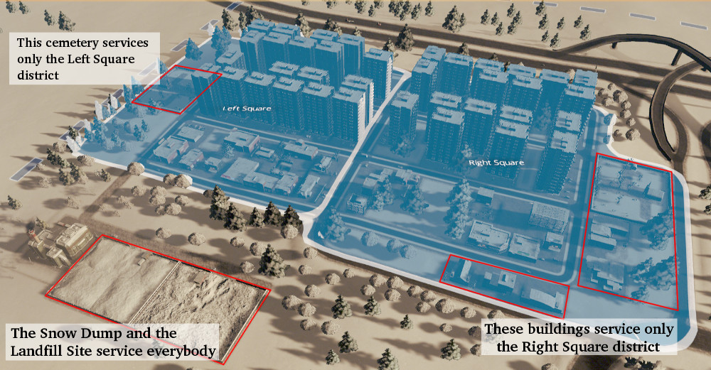

# District Service Limit Mod

## Overview

This mod allows city mayors playing `Cities Skylines` to restrict the dispatching of service vehicles to the current district only. The full explanation can be found at the mod's [Steam workshop page](http://steamcommunity.com/sharedfiles/filedetails/?id=649522495).

## Technical notes

This mod is implemented in C# using the Colossal Order API and replaces the AI of some game objects. As a result, it's very likely to conflict with other mods that have a similar approach to function.